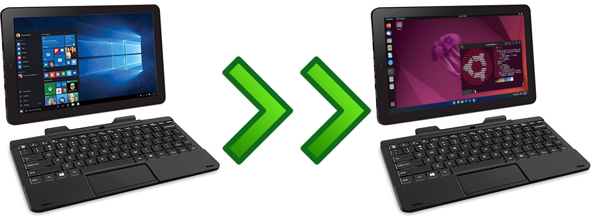

# Linux on the RCA Cambio 10.1 Tablet



# Distro support

Generally any Linux distribution will work with some alteration. Very few
distros currently work out of the box on this tablet due to the use of a 32
bit firmware on an amd64 Atom CPU.

As of 2024, the most recent versions of the compatible distros support most
of the hardware out-of-the-box: keyboard, display, screen rotation, Wifi,
Bluetooth, audio and battery management. However, as of May 2024 there is
[no working support for the cameras](https://askubuntu.com/questions/1250560/why-doesnt-my-camera-work-when-theres-a-kernel-module-for-the-driver)
(i.e. the OV2680 sensor) yet.

## Debian

Currently the latest Debian releases (11.x and 12.x) show several incompatibilities
with the hardware, and older releases (10.x or older) don't fully support the tablet
capabilities, making the experience suboptimal when using this distro.

If installing Debian 11.9 or older, use the
[images including firmware packages](https://cdimage.debian.org/cdimage/unofficial/non-free/cd-including-firmware/),
otherwise (at least) Wifi won't work.

### Troubleshooting

- If the installer can't connect to your Wifi network, select "Enter SSID manually"
  and type the network name. If it still doesn't connect, try switching to an open
  network (or vice-versa).
- If your Wifi connection keeps dropping and not coming back, restart the
  chip service with `sudo systemctl restart rtl8723bsbt.service`.
- On Debian 12.x, after you log in audio is usually muted and routed to the headphones.
  You can reset its state back by selecting the headphones, and then the speakers in
  the sound widget, or with `alsaucm -c bytcr-rt5640 set _verb HiFi set _enadev Speaker`.
- Usually when the tablet enters in suspended mode it doesn't wake up. Disable
  "Automatic Suspend" and "Power Button Behavior" in the Power section in Settings.

### Known issues

- The Wifi connection is pretty unstable on Debian 12.x, requiring the chip service to
  be restarted often.
- On Debian 12.x you may see a flood of messages saying "ASoC: no backend DAIS enabled
  enable for ... Port" on the console. This
  [bug will be fixed](https://gitlab.freedesktop.org/pipewire/pipewire/-/issues/3407)
  in a future update and doesn't affect the audio experience.

## Ubuntu

[Ubuntu 22](https://releases.ubuntu.com/jammy/ubuntu-22.04.4-desktop-amd64.iso)
is currently the most stable release.

All [Ubuntu versions with EFI boot](https://old-releases.ubuntu.com/releases/) 
(since Ubuntu 10) are meant to run on 64 bit firmware, thus unmodified installers
won't boot up. To work around that you can:

- Use Linuxium's
  [isorespin.sh](http://linuxiumcomau.blogspot.com.au/2017/06/customizing-ubuntu-isos-documentation.html)
  to create a bootable installer image.
- Use Linuxium's
  [isorespinner.sh](https://linuxiumcomau.blogspot.com/2022/04/customizing-ubuntu-isos-documentation.html)
  to create a bootable installer image.
- Use [Ventoy](https://github.com/ventoy/Ventoy) to create a bootable USB
  stick that can boot the original, unmodified images.

### Troubleshooting

- If the installer powers off the tablet while in the splash screen, try disabling
  the SOC board sensor in the BIOS (in the Advanced tab). You can reenable it
  back after you finish the installation.
- Always connect to Wifi during installation so the installer can download the
  32-bit boot binaries, otherwise the installer will fail at the end while
  installing GRUB.
- If the Ubuntu 22 installer freezes constantly, try installing just the
  base/minimum system and no additional firmware/media formats.
- On Ubuntu 22, if using Gnome on Wayland (default) the sound widget won't
  show, the sound settings will be disabled and you'll have no audio. Using
  Gnome on Xorg, audio works fine.
- If your Wifi connection keeps dropping and not coming back, restart the
  chip service with
  `sudo modprobe -rv r8723bs ; sleep 5 ; sudo modprobe r8723bs ; sudo systemctl restart NetworkManager`.
  Usually a single restart fixes the issue.

### Known issues

- As of May 2024, the Ubuntu 24 installer crashes frequently, never finishing
  the installation, and currently there's no option to upgrade from Ubuntu 22
  to Ubuntu 24.
- Ubuntu 20 has no audio working, and it also inverts both the video orientation
  (even with the display orientation fix explained below) and the mouse cursor,
  making it hard to use in graphic mode.

## Void Linux

Need to create the custom ISO with Void's mklive and [PR102](https://github.com/voidlinux/void-mklive/pull/102).

## [OpenBSD](openbsd/)

Not a Linux distro but includes support for bootia32.efi on the install media (install61.fs).

## Fedora

[Fedora 35](https://download.fedoraproject.org/pub/fedora/linux/releases/35/Workstation/x86_64/iso/Fedora-Workstation-Live-x86_64-35-1.2.iso)
is currently the most stable release.

### Troubleshooting

- On Fedora 36 or newer, after you log in audio is usually muted and routed to the headphones.
  You can reset its state back by selecting the headphones, and then the speakers in
  the sound widget or in Settings.
- If you upgrade Fedora 35 to 37, the system won't boot up anymore. You can still boot the
  previous kernel from GRUB though.

### Known issues

- On Fedora 40 Bluetooth doesn't turn on.
- On Fedora 36 or newer, the screen won't automatically rotate in tablet mode.

# Hardware

- CPU: Intel®️ Atom™️ quad-core CPU Z3735F @ 1.33 GHz
- RAM: 2GB
- Storage: 32GB eMMC, microSD slot (up to 64GB)
- Audio: Realtek ALC5642
- Wifi: Realtek RGN RTL8723BS Wireless LAN 802.11 b/g/n 2.4GHz SDIO Network Adapter
- Bluetooth: Realtek RGN RTL8723BS (Bluetooth 4.0)
- Battery: 2 x 3.7V batteries (unknown capacity, "up to 6 hours battery life"), with AXP288 power management IC
- Display: 10.1", 1280x800 pixels, Intel HD integrated graphics
- Touchscreen: SileadTouch 10-finger multi-touch
- Camera: 1MP (front camera) and 2MP (rear camera), both using the OV2680 sensor
- Ambient light sensor: Solteam JSA-1212
- Gyroscopic sensor: Bosch BMG160
- Acceleration/compass sensor: AK09911C8KXCJK-1013
- Audio output: mono speaker, 3.5mm combo audio jack
- Video output: micro HDMI
- USB: micro USB 2.0 port, USB 2.0 port
- Weight: 2.13 lbs
- Dimensions: 10.2" (W) x 0.39" (D) x 6.5" (H)
- FCC ID: A2HW101

# Configuration

## Display

By default the RCA Cambio runs in portrait mode. To change it to landscape mode, edit `/etc/default/grub` and update `GRUB_CMDLINE_LINUX_DEFAULT`:

- If you're using only the text terminal, append `video=efifb fbcon=rotate:1`.
- If you're using a desktop environment, append `video=DSI-1:panel_orientation=right_side_up`.

Update GRUB by running `sudo grub2-mkconfig -o /boot/efi/EFI/fedora/grub.cfg` on Fedora or `sudo update-grub` on Debian or Ubuntu.

Other [display orientations](https://docs.kernel.org/fb/modedb.html) are possible.

You can confirm your video display by:

1. Getting the card devices by executing `ls /sys/class/drm`.
2. Finding the one for your display, running `cat /sys/class/drm/<card device name here>/modes` to see the resolution (800x1280) and determining which is which (mine was `card0-DSI-1`).

### Known issues

- Currently there's [no way to rotate the screen](https://www.gnu.org/software/grub/manual/grub/grub.html#gfxmode) in GRUB.
- Linux Kernel 4.11 and higher is needed for DRM video acceleration.

## Touchscreen

For the touchscreen to work it requires some firmware files and calibration.
The SileadTouch firmware files can be obtained from the
[gsl-firmware project](https://github.com/onitake/gsl-firmware) and must be
added to the `/lib/firmware` folder; furthermore, the touchscreen-specific
firmware file must be named `mssl1680.fw`. You can do it by running:

```
wget https://github.com/onitake/gsl-firmware/raw/master/firmware/rca/w101v2/SileadTouch.fw
wget https://github.com/onitake/gsl-firmware/raw/master/firmware/rca/w101v2/silead_ts.fw
wget https://github.com/onitake/gsl-firmware/raw/master/firmware/rca/w101v2/firmware.fw
sudo mkdir /lib/firmware/silead
sudo mv firmware.fw /lib/firmware/silead/mssl1680.fw
sudo mv SileadTouch.fw silead_ts.fw /lib/firmware/silead/
```

The calibration settings can be added by creating the file `/etc/udev/rules.d/95-libinput.rules`
with the following line:

`ATTRS{name}=="silead_ts", ENV{LIBINPUT_CALIBRATION_MATRIX}="0.0 4.55 0.0 -2.5 0.0 1.01 0.0 0.0 1.0"`

Then restart the system for the changes to take effect.

### Calibration process

You can confirm the calibration settings by doing it again.

1. The calibration process must be done using Xorg, as Wayland doesn't expose the
   required settings.
2. Download and build
   [`xlibinput_calibrator`](https://github.com/kreijack/xlibinput_calibrator),
   as `xinput_calibrator` doesn't compute the required calibration matrix. You
   can do it by running:
   ```
   # On Fedora, run:
   # sudo yum install gcc-g++ libX11-devel libXi-devel libXrandr-devel git
   # On Debian or Ubuntu, run:
   # sudo apt-get install g++ libx11-dev libxi-dev libxrandr-dev git make
   git clone https://github.com/kreijack/xlibinput_calibrator.git
   cd xlibinput_calibrator/src/
   make
   ```
3. Run `xinput_calibrator` under the original screen rotation; touch (preferably
   using a stylus) each one of the 4 corners on the screen to generate the
   calibration matrix:
   ```
   xrandr --orientation normal
   ./xlibinput_calibrator --show-xinput-cmd
   xrandr --orientation right
   ```
   The touchscreen should be now calibrated; update the udev settings with the
   values displayed by `xlibinput_calibrator` for the `xinput` command.

### Troubleshooting

- Run `sudo dmesg | grep -i silead` to ensure that the firmware files were loaded.
  You should see some messages referencing the firmware and the device (e.g.
  `silead_ts i2c-MSSL1680:00: Silead chip ID: 0x50910000`).
- To double check the udev rule, display the information of each mouse device using
  `udevadm info -a -p /sys/class/input/mouse<N>` (mine was `mouse0`); you should
  find one device with the attribute `ATTRS{NAME}=="silead_ts"`.
- Run `xinput` to check the list of input devices; there should be a `silead_ts`
  pointer if using Gnome on Xorg, or a `xwayland-touch` pointer if using Gnome on
  Wayland.
- To check if the calibration parameters were applied, start Gnome on Xorg and run
  `xinput --list-props silead_ts`. The list of properties should include the line
  `libinput Calibration Matrix (341): 0.000000, 4.550000, 0.000000, -2.500000, 0.000000, 1.010000, 0.000000, 0.000000, 1.000000`.
- Using Gnome on Xorg, check the file `~/.local/share/xorg/Xorg.0.log` for errors
  related to the calibration settings. If the settings are correct the log should
  include the line
  `silead_ts: applying calibration: 0.000000 4.550000 0.000000 -2.500000 0.000000 1.010000 0.000000 0.000000 1.000000`.

### Known issues

- The on-screen keyboard appears when you touch any sort of text input. A
  [feature request](https://gitlab.gnome.org/GNOME/gnome-shell/-/issues/872)
  to keep it closed if a physical keyboard is present was rejected in 2020.
- Linux kernel 5.10 or older won't load the Silead firmware.

# Tips

## Booting

- To force the tablet to power off, keep the power button pressed for 12s.
- The tablet won't boot from a SD card, only from a USB stick. You can use a
  USB SD card reader, but be aware that some may not be recognized at boot.
- Unplugging the USB stick from the tablet usually changes the boot order, and
  you have to go to the BIOS settings and set it up again.
- To access the BIOS settings, press the [Delete] key repeatedly once the RCA logo
  appears on screen when the tablet boots.
- If GRUB doesn't appear when your Linux distro is booting up, keep the [Shift] key 
  pressed when the tablet boots (i.e., when the RCA logo is displayed) until you
  see the GRUB menu.
- You can reboot the tablet and open the BIOS settings automatically by running
  `systemctl reboot --firmware-setup`.
- If the EFI boot entries are messed up you can delete them by running
  `for j in {0..9} ; do for i in {0..9} ; do sudo efibootmgr -b $i -B ; done ; done`.
  Ignore the error messages `Could not delete boot variable: Invalid argument`, and
  remember to update GRUB after running the command above.

## Keyboard

- The [F1]...[F12] keys default to multimedia commands, so you must keep the [Fn]
  key pressed when pressing [F1]...[F12] (for example, to switch to a console).
- The keyboard is a bit finicky with multi-key presses (e.g. [Ctrl]+[Alt]+[F1]).
  Usually pressing one key after the other is the best way to do it, instead of
  pressing all keys simultaneously.

## Gnome / GUI

- Newer distros use the Wayland compositor by default, but that can be changed
  to Xorg (and back) during login: just click the gear at the right bottom corner
  after selecting your user and choose your option. Your choice will be remembered
  on the next login.

## Setting up Linux

- If your user is not allowed to run `sudo`, run `su` and then
  `sudo adduser YOUR_USERNAME sudo`. Log out and log in again for changes to take
  effect.
- The SSH server can be installed by running
  `sudo yum install openssh-server` on Fedora or
  `sudo apt-get install openssh-server` on Debian or Ubuntu, and then
  `systemctl enable ssh`.
- Most administrative tools are located at `/sbin`, but some network-related tools
  might require the net-tools package to be installed first by running
  `sudo yum install net-tools` on Fedora or `sudo apt-get install net-tools` on
  Debian or Ubuntu.

# Similar pages

- [Install Linux on Nextbook Flexx Baytrail tablet](https://github.com/burzumishi/linux-baytrail-flexx10)

